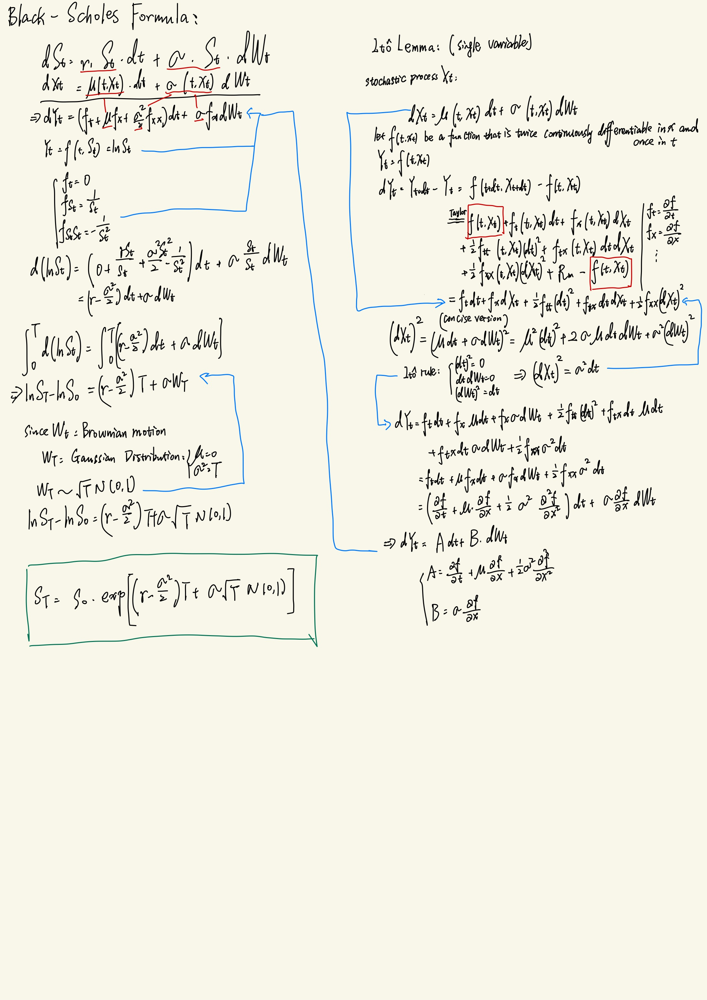

# Financial Formula
## 1. B-S Formula
The prcess of getting the formula using Itô Lemma

Code Reference:
1. **Joshi** *C++ Design Patterns and Derivatives Pricing*
2. https://developer.nvidia.cn/blog/profit-and-loss-modeling-on-gpus-with-iso-c-language-parallelism/
3. https://developer.nvidia.cn/blog/how-to-accelerate-quantitative-finance-with-iso-c-standard-parallelism/